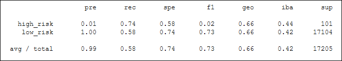
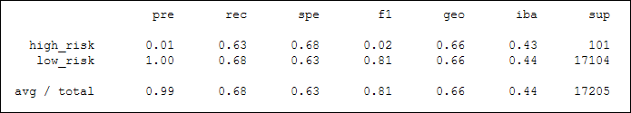
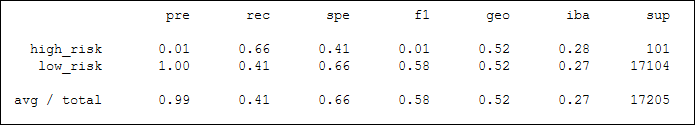
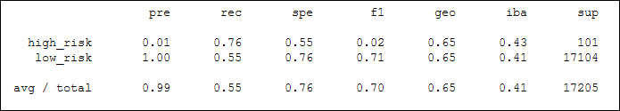
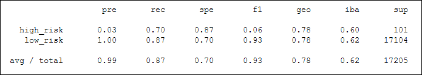
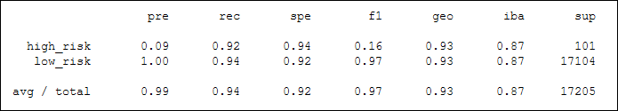

# Module 17 Challenge - Credit Risk Analysis - Machine Learning

## Overview

Project Origination Date: 2021-09-27

#### Special Explanatory Note

LendingClub was founded in 2006, with initial Loans offered to customers and associated Notes offered directly to qualified investors starting in 2007.
This lending model was classified as Peer-to-Peer lending, facilitated by the LendingClub Platform.

As of December 31, 2020, the Notes platform available to qualified investors was retired in the wake of LendingClub's acquisition of
Radius Bancorp and the associated corporate restructuring and adjustment of business model.

As of today (Q3-2021), Personal and Business Loans are still available to customers through LendingClub. Rather than offering these individual Loan Notes
directly to individual qualified investors as under the previous business model, the notes are sampled and marketed in bundles to
institutional investors.

The most-recent publicly available LendingClub Loan Data (via archive.org Wayback Machine) is from Q2-2019 from the Aug. 19, 2019 crawl.

### Purpose

The purpose of this analysis is to predict Credit Risk for Borrowers using a historical collection of Loan Data using a Machine Learning Approach.

### Tasks

1. Input Data and Perform Basic Data Cleaning
2. Split the Data into Training and Testing Sets
3. Compare two Oversampling Algorithms (Naive Random Oversampling vs. SMOTE Oversampling)
4. Compare two Undersampling Algorithms (Cluster Centroids vs. Combination Over and Under Sampling)
5. Compare two Ensemble Algorithms (Balanced Random Forest Classifier vs. Easy Ensemble AdaBoost Classifier)

### Approach

Use Python within a Jupyter Notebook to Clean Data and Generate Results

### Deliverables

1. Use Resampling Models to Predict Credit Risk
2. Use the SMOTEENN Algorithm to Predict Credit Risk
3. Use Ensemble Classifiers to Predict Credit Risk
4. A Written Report on the Credit Risk Analysis (this README.md)

### Resources

- Software:
	- Jupyter notebook server 6.3.0, running Python 3.7.10 64-bit
		- Dependencies:
			- collections [Counter]
			- imblearn.combine [SMOTEENN]
			- imblearn.ensemble [BalancedRandomForestClassifier, EasyEnsembleClassifier]
			- imblearn.metrics [classification_report_imbalanced]
			- imblearn.over_sampling [RandomOverSampler, SMOTE]
			- imblearn.under_sampling [ClusterCentroids]
			- numpy
			- pandas
			- pathlib
			- sklearn.linear_model [LogisticRegression]
			- sklearn.metrics [balanced_accuracy_score, confusion_matrix]
			- sklearn.model_selection [train_test_split]
			- sklearn.preprocessing [StandardScaler]
			- warnings

- Data:
	- `LoanStats_2019Q1.csv`
		- Client-provided dataset of Anonymized LendingClub Notes Approval Results and Associated Metadata.
	- `LoanStats_2019Q1_front_and_endmatter_stripped_ascii_subs.csv`
		- User-edited version of `LoanStats_2019Q1.csv`
		- In `LoanStats_2019Q1.csv`, Line 1 was originally a non-Header URL for LendingClub Prospectus: (https://www.lendingclub.com/info/prospectus.action), and the final 4 lines
		were two blank lines followed by two different Sums for total amounts funded in policy codes 1 & 2.
		- Original source file was retained, unmodified, on disk for reference purposes, but to facilitate easier analysis and data manipulation, these 5 lines were deleted in
		a copied version of the file, `{base_file_name}_front_and_endmatter_stripped.csv`
		- The 36 Non-ASCII Characters identified in the dataset were replaced as described in [Appendix A](#appendix-a---data-lexicon), Table 3. The resulting version of the
		file was renamed `LoanStats_2019Q1_front_and_endmatter_stripped_ascii_subs.csv` and saved.
		- Spelling errors were identified in the dataset, but have been retained as original at this time.
		- This version of the file is completely rectangular and homogeneous, in terms of the number of rows and columns contained within.
	- `LCDataDictionary.xlsx`: LendingClub Provided Data Dictionary. Most-Recent version available from Archive.org Wayback Machine from Aug. 19, 2019.
	URL: (https://web.archive.org/web/20190819231817/https://www.lendingclub.com/info/download-data.action)
	- `credit_risk_resampling_starter_code.ipynb`
		- Client-provided Starter Code Jupyter Notebook File
	- `credit_risk_resampling.ipynb`
		- User-updated Jupyter Notebook derived from `credit_risk_resampling_starter_code.ipynb`
	- `credit_risk_ensemble_starter_code.ipynb`
		- Client-provided Starter Code Jupyter Notebook File
	- `credit_risk_ensemble.ipynb`
		- User-updated Jupyter Notebook derived from `credit_risk_ensemble_starter_code.ipynb`
	  
Additional information about `LoanStats_2019Q1.csv` and `LoanStats_2019Q1_front_and_endmatter_stripped_ascii_subs.csv` is outlined below in [Appendix A](#appendix-a---data-lexicon), Tables 1 & 2.
                                            
#### Data Quality                           

##### ASCII Check

As a first-pass data cleaning task, `LoanStats_2019Q1_front_and_endmatter_stripped.csv` was checked for the presence of non-ASCII Characters.
36 Lines were identified containing non-ASCII characters, with one-match per line, all in Borrower-Supplied Field 11 `emp_title`, for a total of 36 non-ASCII characters in the dataset.
The vast majority (20) of these matches were Unicode Right Single Quotes (U+2019), one was a Unicode En dash (U+2013), and the rest were accented Latin Characters,
mostly inadvertently incorrectly applied or corrupted (e.g. "Área supervisor").
In the places where these non-ASCII characters were correctly applied, they were in non-English language job titles and proper names such as "Chófer", "Construcción",
"Ana González", and "Estée Lauder".

These characters were replaced with an equivalent from the ASCII Character Set, and
non-English job titles and proper names retained the spelling convention of their origin language with the exception of the non-ASCII to ASCII substitution.
Since the number of replacements were so few, and to better illustrate the nature of these updates, they have all been reproduced with explanatory notes below in
[Appendix A](#appendix-a---data-lexicon), Table 3.

#### Post-ASCII Check

The remainder of non-blank data containing fields and records were quite regular, with expected values and data types within reasonable ranges. There are two Percent-formatted
fields (`int_rate`, `revol_util`) with the percent sign presented alongside the data, and the remaining numeric fields contain no symbols except a decimal point. The `total_pymnt` field
was not rounded nor truncated, and thus contains 2,132 values with 3 or more digits to the right of the decimal place.

As explained in [Appendix A](#appendix-a---data-lexicon), Table 2, the Borrower-Supplied `emp_title` contains a multitude of 40-character truncations, leading and trailing whitespace,
typing and spelling errors, cryptic industry-specific terms and abbreviations, and foreign-language words in Spanish and French. Considering the size of the dataset, however,
the vast majority of entries are meaningful and free of errors.

It is unclear if the other fields with only -EMPTY STRING- values were cleared as part of the anonymization process, or if the data was always NULL.

## Deliverables

### Deliverable 1

See `credit_risk_resampling.ipynb`

### Deliverable 2

See `credit_risk_resampling.ipynb`

### Deliverable 3

See `credit_risk_ensemble.ipynb`

## Results

### Overview of the Analysis

The purpose of this analysis was to compare and contrast the accuracy of a battery
of Machine Learning Algorithms to predict whether a given Loan would be 'low_risk'
or 'high_risk', given a collection of associated input data.

### Deliverable 1 Overview

A brief summary of the results obtained while completing Deliverable 1
is shown here in Table R1 (all values rounded to 3 digits).

**Table R1: Deliverable 1 Credit Risk Resampling Results Overview**
| Method                            | Balanced Accuracy Score    | high_risk Precision Score    | high_risk Recall Score | high_risk F1 Score
|-----------------------------------|----------------------------|------------------------------|------------------------|-------------------
| Naive Random Oversampling         | 0.660                      | 0.01                         | 0.74                   | 0.02
| SMOTE Oversampling                | 0.658                      | 0.01                         | 0.63                   | 0.02
| Cluster Centroids Undersampling   | 0.537                      | 0.01                         | 0.66                   | 0.01

### Deliverable 2 Overview

A brief summary of the results obtained while completing Deliverable 2
is shown here in Table R2 (all values rounded to 3 digits).

**Table R2: Deliverable 2 Credit Risk Resampling Results Overview**
| Method                            | Balanced Accuracy Score    | high_risk Precision Score    | high_risk Recall Score | high_risk F1 Score
|-----------------------------------|----------------------------|------------------------------|------------------------|-------------------
| SMOTEENN Undersampling            | 0.654                      | 0.01                         | 0.76                   | 0.02

### Deliverable 3 Overview

A brief summary of the results obtained while completing Deliverable 3
is shown here in Table R3 (all values rounded to 3 digits).

**Table R3: Deliverable 3 Credit Risk Ensemble Results Overview**
| Method                            | Balanced Accuracy Score    | high_risk Precision Score    | high_risk Recall Score | high_risk F1 Score
|-----------------------------------|----------------------------|------------------------------|------------------------|-------------------
| Balanced Random Forest Classifier | 0.788                      | 0.03                         | 0.70                   | 0.06
| AdaBoost Classifier               | 0.932                      | 0.09                         | 0.92                   | 0.16

### Discussion of Results

What follows is a brief discussion of the results obtained for each of the 6
models tested that is displayed without commentary in Tables R1-R3 above.

- Naive Random Oversampling
	- Poor Accuracy and Fair Recall, very low Precision
- SMOTE Oversampling
	- Poor Accuracy and Poor Recall, very low Precision
- Cluster Centroids Undersampling
	- Poor Accuracy and Poor Recall, very low Precision
- SMOTEENN Undersampling
	- Poor Accuracy and Poor Recall, very low Precision
- Balanced Random Forest Classifier
	- Fair Accuracy and Fair Recall, very low Precision
- AdaBoost Classifier
	- Good Accuracy and Good Recall, improved but still very low Precision

Imbalanced Classification Reports for each of the 6 models are reproduced for reference
below as Figures 1-6.

**Figure 1: Naive Random Oversampling Imbalanced Classification Report**

**Figure 2: SMOTE Oversampling Imbalanced Classification Report**

**Figure 3: Cluster Centroids Undersampling Imbalanced Classification Report**

**Figure 4: SMOTEENN Undersampling Imbalanced Classification Report**

**Figure 5: Balanced Random Forest Imbalanced Classification Report**

**Figure 6: AdaBoost Imbalanced Classification Report**

## Summary

Overall, all 6 models performed poorly to predict whether a given loan would be 'high_risk' or not.

The Easy Ensemble AdaBoost Classifier model performed the best of all currently-tested alternatives,
but still too poorly to recommend.

For 'high_risk' predictions, this model achieved 9% Accuracy
with 92% Recall. This means that out of 100 Loans flagged as 'high_risk', 9 were actually 'high_risk',
and that 92% of 'high_risk' Loans were correctly identified. The low F1 Score for this model of 0.16
reflects this significant difference between the Precision and Sensitivity of the model.

I would not recommend the use of any of these models to predict Credit Risk with any level of confidence.

## Appendix A - Data Lexicon

**Table 1: Source Data Description**
| File Name                                                       | Brief Description of Contents
|-----------------------------------------------------------------|------------------------------
| `LoanStats_2019Q1.csv`                                          | 115,681 Lines, 91 MB. Double-Quoted-Field Comma-Separated-Value UTF-8 Flat Plaintext file containing LendingClub Notes Approval Results and Associated Metadata. Unix-Style Line-endings (LF-0A). Note that Field 11 (`emp_title`) is the only field to include embedded commas with current file contents.
| `LoanStats_2019Q1_front_and_endmatter_stripped_ascii_subs.csv`  | 115,676 Lines, 91 MB. Disk Copy of `LoanStats_2019Q1.csv`, with the removal of 5 lines as described above in *Resources*, and the replacement of non-ASCII Characters as described below in *Appendix A, Table 3*. Double-Quoted-Field Comma-Separated-Value ASCII Plaintext Flat file containing LendingClub Notes Approval Results and Associated Metadata. Unix-Style Line-endings (LF-0A). 1 Header Line, remainder of lines in file correspond (1 Line):(1 Loan Record), all lines unique.

**Table 2: `LoanStats_2019Q1_front_and_endmatter_stripped_ascii_subs.csv` Fields** 
*Note:* To avoid repetition for each numeric field, all numbers referred to in dataset are displayed using Arabic Numerals.
| Field Number                     | Field Name                                    | LendingClub Data Dictionary Description of Contents                                                                                                                                                                                      | Additional Explanation of Contents
|----------------------------------|-----------------------------------------------|-------------------------------------------------------------------------------------------------------------------------------------------------------------------------------------------------------------------------------------------|-----------------------------------
| 1                                | `id`                                          | A unique LC assigned ID for the loan listing.                                                                                                                                                                                             | All values anonymized to -EMPTY STRING-
| 2                                | `member_id`                                   | A unique LC assigned Id for the borrower member.                                                                                                                                                                                          | All values anonymized to -EMPTY STRING-
| 3                                | `loan_amnt`                                   | The listed amount of the loan applied for by the borrower. If at some point in time, the credit department reduces the loan amount, then it will be reflected in this value.                                                              | Loan amount in $USD. Integer digits (no thousands separators, no decimals, no symbols). 1,499 unique quantities. 4-5 digits. Min: 1,000, Max: 40,000
| 4                                | `funded_amnt`                                 | The total amount committed to that loan at that point in time.                                                                                                                                                                            | Funded amount in $USD. Integer digits (no thousands separators, no decimals, no symbols). 1,499 unique quantities. 4-5 digits. Min: 1,000, Max: 40,000
| 5                                | `funded_amnt_inv`                             | The total amount committed by investors for that loan at that point in time.                                                                                                                                                              | Amount Funded by Investors in $USD. Integer digits (no thousands separators, no decimals, no symbols). 1,524 unique quantities. 3-5 digits. Min: 725, Max: 40,000
| 6                                | `term`                                        | The number of payments on the loan. Values are in months and can be either 36 or 60.                                                                                                                                                      | Text field describing loan term, one of two options: "36 months" or "60 months". Respective count: (78,429; 37,246)
| 7                                | `int_rate`                                    | Interest Rate on the loan                                                                                                                                                                                                                 | Interest Rate Percentages Represented in the format "[d]d.dd%". 53 unique quantities. Min: 6.00%, Max: 30.89%
| 8                                | `installment`                                 | The monthly payment owed by the borrower if the loan originates.                                                                                                                                                                          | Monthly payment in $USD. Currency values displayed as floating-point numbers truncated to 1-2 decimal places (no thousands separators, no symbols) in the format "[d][d]dd.d[d]". Min: 30.64, Max: 1,676.23
| 9                                | `grade`                                       | LC assigned loan grade                                                                                                                                                                                                                    | Lending Club Assigned Alphabetic Grade for Loan. Single Character Alphabetic Classification in the range [A:G]. Count Breakdown: A: 37,060; B: 33,129; C: 27,277; D: 14,797; E: 3,364; F: 31; G: 17
| 10                               | `sub_grade`                                   | LC assigned loan subgrade                                                                                                                                                                                                                 | Lending Club Assigned Alphanumeric Sub-Grade for Loan. Two Character code in the format "ad". Grades [A:F] have Sub-Grades [1:5], and Grade G has Sub-Grades [1:3]. Count Breakdown available, but not reproduced here for the sake of brevity.
| 11                               | `emp_title`                                   | The job title supplied by the Borrower when applying for the loan.*                                                                                                                                                                       | Borrower-Supplied Job Title. 39,374 unique entries. ASCII Free Text ranging from 0 to 40 characters (sometimes truncated). 19,515 entries -EMPTY STRING-. Original spellings, abbreviations, and errors retained, with the exception of the replacement of Non-ASCII Characters with their nearest ASCII equivalent. 198 entries have leading white space, and 13,509 entries have trailing white space. Spelling was checked for, but not corrected. In some cases, correct spelling could be guessed at, in others not. The basis for spell-checking is the OpenOffice en_us Dictionary, followed by a visual scan of the job titles and addition of correctly spelled industry-specific abbreviations and terms to a custom whitelist of English words. Following this procedure, after allowing for known Britishisms, correctly-spelled Spanish and French words, known common abbreviations, unknown industry abbreviations, incorrect capitalizations, lack of spaces between otherwise correctly-spelled words, and assuming that any truncated line would have been correctly spelled had a truncation not occurred, there are approximately 1,348 entries with recognizable spelling or typing errors present. *Note:* In light of the fact that the English Language has no absolute Lexical Authority, and of the adaptable and changing nature of terms and definitions, another analyst would likely come up with a slightly different total number of spelling and typing errors present in this Field.
| 12                               | `emp_length`                                  | Employment length in years. Possible values are between 0 and 10 where 0 means less than one year and 10 means ten or more years.                                                                                                         | Employment length in years. 12 possible alternatives. Format of "d year[s]" for years 1-9. Less than 1 year is recorded as "< 1 year", and greater than 10 years is recorded as "10+ years". 11,101 records are "n/a"
| 13                               | `home_ownership`                              | The home ownership status provided by the borrower during registration or obtained from the credit report. Our values are: RENT, OWN, MORTGAGE, OTHER                                                                                     | (Actual) Values are: RENT, OWN, MORTGAGE, ANY, NONE
| 14                               | `annual_inc`                                  | The self-reported annual income provided by the borrower during registration.                                                                                                                                                             | Borrower-Reported Annual Income, some values present as Integers, some values reported with cents to two decimal places (no symbols, no thousands separators). Min: $0.00, Max: $9,000,000.00
| 15                               | `verification_status`                         | Indicates if income was verified by LC, not verified, or if the income source was verified                                                                                                                                                | Values: "Verified", "Not Verified", "Source Verified"
| 16                               | `issue_d`                                     | The month which the loan was funded                                                                                                                                                                                                       | Values: "Jan-2019", "Feb-2019", "Mar-2019"
| 17                               | `loan_status`                                 | Current status of the loan                                                                                                                                                                                                                | Values: "Current", "Issued", "Fully Paid", "In Grace Period", "Late (16-30 days)", "Late (31-120 days)", "Charged Off"
| 18                               | `pymnt_plan`                                  | Indicates if a payment plan has been put in place for the loan                                                                                                                                                                            | Values: "n" (Count: 115,675). Presumably, if any loans had a payment plan in place, an alternative allowed value would be "y"
| 19                               | `url`                                         | URL for the LC page with listing data.                                                                                                                                                                                                    | Values: -EMPTY STRING- (Count: 115,675). Presumably anonymized along with `id` and `member_id`
| 20                               | `desc`                                        | Loan description provided by the borrower                                                                                                                                                                                                 | Values: -EMPTY STRING- (Count: 115,675). Presumably anonymized along with `id` and `member_id`
| 21                               | `purpose`                                     | A category provided by the borrower for the loan request.                                                                                                                                                                                 | Values: "debt_consolidation", "credit_card", "home_improvement", "other", "major_purchase", "medical", "small_business", "car", "house", "vacation", "moving", "renewable_energy" (12 possibilities)
| 22                               | `title`                                       | The loan title provided by the borrower                                                                                                                                                                                                   | Values: "Debt consolidation", "Credit card refinancing", "Home improvement", "Other", "Major purchase", "Medical expenses", "Business", "Car financing", "Home buying", "Vacation", "Moving and relocation", "Green loan" (12 possibilities)
| 23                               | `zip_code`                                    | The first 3 numbers of the zip code provided by the borrower in the loan application.                                                                                                                                                     | 877 unique entries. 5 character Alphanumeric code showing the first 3 digits of the zip code provided by the borrower in the loan application, followed by two x's, in the format of "dddxx". Min: 010xx, Max: 999xx
| 24                               | `addr_state`                                  | The state provided by the borrower in the loan application                                                                                                                                                                                | Two-character capitalized US State (*and* District) Abbreviations following the United States Postal Service Standard. 50 unique entries correctly corresponding to 49 out of the 50 current United States of America plus "DC" for the District of Columbia (a2021 AD). The US State of Iowa is not represented. Prior to the restructuring of Lending Club, Notes were available to qualified investors in Iowa, but not loans.
| 25                               | `dti`                                         | A ratio calculated using the borrower’s total monthly debt payments on the total debt obligations, excluding mortgage and the requested LC loan, divided by the borrower’s self-reported monthly income.                                  | 'Debt-to-Income' Ratio. 6,537 unique entries. 257 entries -EMPTY STRING-, 131 entries "0". All other values shown as Integer or Decimal value with 1-2 digits. Min-Non-Zero: 0.02, Max: 999 (potential overflow), Max-Non-Overflow: 962.12
| 26                               | `delinq_2yrs`                                 | The number of 30+ days past-due incidences of delinquency in the borrower's credit file for the past 2 years                                                                                                                              | Integer Values in the range [0:21]. 1-2 digits. Min-Non-Zero: 1, Max: 21
| 27                               | `earliest_cr_line`                            | The month the borrower's earliest reported credit line was opened                                                                                                                                                                         | Combination Alpha and Numeric representation of Month Abbreviation (1 Capital Letter followed by 2 lowercase letters), followed by a dash and a 4-digit year (e.g. "Jan-2007"). 652 unique entries. Earliest: January, 1944. Most-Recent: January, 2016.
| 28                               | `inq_last_6mths`                              | The number of inquiries in past 6 months (excluding auto and mortgage inquiries)                                                                                                                                                          | Integer Values in the range [0:5]. 1 digit. Min-Non-Zero: 1, Max: 5
| 29                               | `mths_since_last_delinq`                      | The number of months since the borrower's last delinquency.                                                                                                                                                                               | 132 unique entries. Integer Values, 1-3 digits. 65,799 entries -EMPTY STRING-. Min: 1, Max: 176 (14 years, 8 months)
| 30                               | `mths_since_last_record`                      | The number of months since the last public record.                                                                                                                                                                                        | 108 unique entries. Integer Values, 2-3 digits. 102,252 entries -EMPTY STRING-. Min: 12, Max: 119 (9 years, 11 months)
| 31                               | `open_acc`                                    | The number of open credit lines in the borrower's credit file.                                                                                                                                                                            | 68 unique entries. Integer Values, 1-2 digits. Min: 0, Min-Non-Zero: 1, Max: 72
| 32                               | `pub_rec`                                     | Number of derogatory public records                                                                                                                                                                                                       | 5 unique entries. Integer Values, 1 digit in the range [0:4]. Min: 0, Min-Non-Zero: 1, Max: 4
| 33                               | `revol_bal`                                   | Total credit revolving balance                                                                                                                                                                                                            | 41,286 unique entries. Integer Values, 1-6 digits. Min: $0.00, Min-Non-Zero: $1.00, Max: $652,794.00
| 34                               | `revol_util`                                  | Revolving line utilization rate, or the amount of credit the borrower is using relative to all available revolving credit.                                                                                                                | Utilization Rate Percentages Represented in the format "[dd]d.[d]%". 1,056 unique quantities. 129 entries -EMPTY STRING-. Min: 0.0%, Min-Non-Zero: 0.1%, Max: 137.3%
| 35                               | `total_acc`                                   | The total number of credit lines currently in the borrower's credit file                                                                                                                                                                  | 111 unique entries. Integer Values, 1-3 digits. Min: 2, Max: 164
| 36                               | `initial_list_status`                         | The initial listing status of the loan. Possible values are – W, F                                                                                                                                                                        | (Actual) Values are: w, f [Lowercase]. 'w' signifies that the Loan in question was listed as a Whole Loan, whose Note was only available to be purchased in its entirety (a program feature targeted at Institutional Investors, along with associated risks). 'f' signifies that the Loan was offered as a standard fractional investment.
| 37                               | `out_prncp`                                   | Remaining outstanding principal for total amount funded                                                                                                                                                                                   | 25,479 unique entries. Decimal Values with 1-5 digits to the left of the decimal place, and 2 digits to the right of the decimal place (no thousands separator or symbols). Min: $0.00, Min-Non-Zero: $0.37, Max: $40,000.00
| 38                               | `out_prncp_inv`                               | Remaining outstanding principal for portion of total amount funded by investors                                                                                                                                                           | 27,149 unique entries. Decimal Values with 1-5 digits to the left of the decimal place, and 2 digits to the right of the decimal place (no thousands separator or symbols). Min: $0.00, Min-Non-Zero: $0.37, Max: $40,000.00
| 39                               | `total_pymnt`                                 | Payments received to date for total amount funded                                                                                                                                                                                         | 37,092 unique entries. Floating Point Values with 1-5 digits to the left of the decimal place, and 1-10 digits to the right of the decimal place (no thousands separator or symbols). Min: $0.00, Min-Non-Zero: $0.19, Max: $41,418.9811651124
| 40                               | `total_pymnt_inv`                             | Payments received to date for portion of total amount funded by investors                                                                                                                                                                 | 38,385 unique entries. Decimal Values with 1-5 digits to the left of the decimal place, and 2 digits to the right of the decimal place (no thousands separator or symbols). Min: $0.00, Min-Non-Zero: $0.19, Max: $41,418.98
| 41                               | `total_rec_prncp`                             | Principal received to date                                                                                                                                                                                                                | 22,729 unique entries. Decimal Values with 1-5 digits to the left of the decimal place, and 2 digits to the right of the decimal place (no thousands separator or symbols). Min: $0.00, Min-Non-Zero: $0.19, Max: $40,000.00
| 42                               | `total_rec_int`                               | Interest received to date                                                                                                                                                                                                                 | 30,580 unique entries. Decimal Values with 1-4 digits to the left of the decimal place, and 2 digits to the right of the decimal place (no thousands separator or symbols). Min: $0.00, Min-Non-Zero: $0.28, Max: $2,735.40
| 43                               | `total_rec_late_fee`                          | Late fees received to date                                                                                                                                                                                                                | 90 unique entries. Decimal Values with 1-2 digits to the left of the decimal place, and 1-2 digits to the right of the decimal place (no thousands separator or symbols). Min: $0.00, Min-Non-Zero: $15.00, Max: $75.24
| 44                               | `recoveries`                                  | post charge off gross recovery                                                                                                                                                                                                            | 1 unique entry, "0.0"
| 45                               | `collection_recovery_fee`                     | post charge off collection fee                                                                                                                                                                                                            | 1 unique entry, "0.0"
| 46                               | `last_pymnt_d`                                | Last month payment was received                                                                                                                                                                                                           | Combination Alpha and Numeric representation of Month Abbreviation (1 Capital Letter followed by 2 lowercase letters), followed by a dash and a 4-digit year (e.g. "Jan-2019"). 5 unique entries, one of which is 18,811 entries -EMPTY STRING-. Earliest: January, 2019. Most-Recent: April, 2019.
| 47                               | `last_pymnt_amnt`                             | Last total payment amount received                                                                                                                                                                                                        | 17,733 unique entries. Decimal Values with 1-5 digits to the left of the decimal place, and 1-2 digits to the right of the decimal place (no thousands separator or symbols). Min: $0.00, Min-Non-Zero: $0.19, Max: $41,409.34
| 48                               | `next_pymnt_d`                                | Next scheduled payment date                                                                                                                                                                                                               | Combination Alpha and Numeric representation of Month Abbreviation (1 Capital Letter followed by 2 lowercase letters), followed by a dash and a 4-digit year (e.g. "Jan-2019"). 3 unique entries, one of which is 2,198 entries -EMPTY STRING-. Earliest: April, 2019. Most-Recent: May, 2019.
| 49                               | `last_credit_pull_d`                          | The most recent month LC pulled credit for this loan                                                                                                                                                                                      | Combination Alpha and Numeric representation of Month Abbreviation (1 Capital Letter followed by 2 lowercase letters), followed by a dash and a 4-digit year (e.g. "Jan-2019"). 6 unique entries, one of which is 2 entries -EMPTY STRING-. Earliest: December, 2018. Most-Recent: April, 2019.
| 50                               | `collections_12_mths_ex_med`                  | Number of collections in 12 months excluding medical collections                                                                                                                                                                          | Integer Values in the range [0:6], 1 digit. Min-Non-Zero: 1, Max: 6
| 51                               | `mths_since_last_major_derog`                 | Months since most recent 90-day or worse rating                                                                                                                                                                                           | 147 unique values. Integer Values, 1-3 digits. 90,677 entries -EMPTY STRING-. Min: 0, Min-Non-Zero: 1, Max: 190 (15 years, 10 months)
| 52                               | `policy_code`                                 | publicly available policy_code=1; new products not publicly available policy_code=2                                                                                                                                                       | 1 unique entry, "1"
| 53                               | `application_type`                            | Indicates whether the loan is an individual application or a joint application with two co-borrowers                                                                                                                                      | 2 unique entries: "Individual", "Joint App"
| 54                               | `annual_inc_joint`                            | The combined self-reported annual income provided by the co-borrowers during registration                                                                                                                                                 | 3,466 unique entries. 98,994 entries -EMPTY STRING-. Decimal Values with 5-7 digits to the left of the decimal place, and 0-2 digits to the right of the decimal place (no thousands separator or symbols). Min: $17,604.00, Max: $1,836,000.00
| 55                               | `dti_joint`                                   | A ratio calculated using the co-borrowers' total monthly payments on the total debt obligations, excluding mortgages and the requested LC loan, divided by the co-borrowers' combined self-reported monthly income                        | 3,536 unique entries. 98,994 entries -EMPTY STRING-. Decimal Values with 1-2 digits to the left of the decimal place, and 0-2 digits to the right of the decimal place (no thousands separator or symbols). Min: 0.00, Min-Non-Zero: 0.11, Max: 39.98
| 56                               | `verification_status_joint`                   | Indicates if the co-borrowers' joint income was verified by LC, not verified, or if the income source was verified                                                                                                                        | 4 unique entries. 101,051 entries -EMPTY STRING-. 3 other entries "Verified", "Not Verified", "Source Verified"
| 57                               | `acc_now_delinq`                              | The number of accounts on which the borrower is now delinquent.                                                                                                                                                                           | 1 unique entry, "0"
| 58                               | `tot_coll_amt`                                | Total collection amounts ever owed                                                                                                                                                                                                        | 3,606 unique entries. Integer Values, 1-6 digits (no thousands separator, no symbols). Min: $0.00, Min-Non-Zero: $1.00, Max: $199,308.00
| 59                               | `tot_cur_bal`                                 | Total current balance of all accounts                                                                                                                                                                                                     | 93,934 unique entries. Integer Values, 1-7 digits (no thousands separator, no symbols). Min: $.00, Min-Non-Zero: $1.00, Max: $4,062,258.00
| 60                               | `open_acc_6m`                                 | Number of open trades in last 6 months                                                                                                                                                                                                    | 14 unique entries. Integer Values, 1-2 digits. Min: 0, Min-Non-Zero: 1, Max: 14
| 61                               | `open_act_il`                                 | Number of currently active installment trades                                                                                                                                                                                             | 39 unique entries. Integer Values, 1-2 digits. Min: 0, Min-Non-Zero: 1, Max: 63
| 62                               | `open_il_12m`                                 | Number of installment accounts opened in past 12 months                                                                                                                                                                                   | 7 unique entries. Integer Values in the range [0:6], 1 digit. Min-Non-Zero: 1, Max: 6
| 63                               | `open_il_24m`                                 | Number of installment accounts opened in past 24 months                                                                                                                                                                                   | 17 unique entries. Integer Values, 1-2 digits. Min: 0, Min-Non-Zero: 1, Max: 22
| 64                               | `mths_since_rcnt_il`                          | Months since most recent installment accounts opened                                                                                                                                                                                      | 272 unique entries. 3,517 entries -EMPTY STRING-. Integer Values, 1-3 digits. Min: 0, Min-Non-Zero: 1, Max: 480 (40 years)
| 65                               | `total_bal_il`                                | Total current balance of all installment accounts                                                                                                                                                                                         | 61,337 unique entries. Integer Values, 1-7 digits (no thousands separator, no symbols). Min: $0.00, Min-Non-Zero: $1.00, Max: $1,260,281.00
| 66                               | `il_util`                                     | Ratio of total current balance to high credit/credit limit on all install acct                                                                                                                                                            | 204 unique entries. 17,319 entries -EMPTY STRING-. Integer Values, 1-3 digits (no symbols). Min: 0, Min-Non-Zero: 1, Max: 313
| 67                               | `open_rv_12m`                                 | Number of revolving trades opened in past 12 months                                                                                                                                                                                       | 18 unique entries. Integer Values, 1-2 digits. Min: 0, Min-Non-Zero: 1, Max: 18
| 68                               | `open_rv_24m`                                 | Number of revolving trades opened in past 24 months                                                                                                                                                                                       | 34 unique entries. Integer Values, 1-2 digits. Min: 0, Min-Non-Zero: 1, Max: 44
| 69                               | `max_bal_bc`                                  | Maximum current balance owed on all revolving accounts                                                                                                                                                                                    | 20,967 unique entries. Integer Values, 1-6 digits (no thousands separator, no symbols). Min: $0.00, Min-Non-Zero: $1.00, Max: $207,484.00
| 70                               | `all_util`                                    | Balance to credit limit on all trades                                                                                                                                                                                                     | 155 unique entries. 24 entries -EMPTY STRING-. Integer Values, 1-3 digits. Min: $0.00, Min-Non-Zero: $1.00, Max: $216.00
| 71                               | `total_rev_hi_lim`                            | Total revolving high credit/credit limit                                                                                                                                                                                                  | 4,024 unique entries. Integer Values, 1-6 digits (no thousands separator, no symbols). Min: $0.00, Min-Non-Zero: $100.00, Max: $759,500.00
| 72                               | `inq_fi`                                      | Number of personal finance inquiries                                                                                                                                                                                                      | 24 unique entries. Integer Values, 1-2 digits. Min: 0, Min-Non-Zero: 1, Max: 29
| 73                               | `total_cu_tl`                                 | Number of finance trades                                                                                                                                                                                                                  | 45 unique entries. Integer Values, 1-2 digits. Min: 0, Min-Non-Zero: 1, Max: 70
| 74                               | `inq_last_12m`                                | Number of credit inquiries in past 12 months                                                                                                                                                                                              | 34 unique entries. Integer Values, 1-2 digits. Min: 0, Min-Non-Zero: 1, Max: 42
| 75                               | `acc_open_past_24mths`                        | Number of trades opened in past 24 months.                                                                                                                                                                                                | 37 unique entries. Integer Values, 1-2 digits. Min: 0, Min-Non-Zero: 1, Max: 45
| 76                               | `avg_cur_bal`                                 | Average current balance of all accounts                                                                                                                                                                                                   | 38,406 unique entries. 7 entries -EMPTY STRING-. Integer Values, 1-6 digits (no thousands separator, no symbols). Min: $0.00, Min-Non-Zero: $1.00, Max: $635,178.00
| 77                               | `bc_open_to_buy`                              | Total open to buy on revolving bankcards.                                                                                                                                                                                                 | 40,975 unique entries. 1,323 entries -EMPTY STRING-. Integer Values, 1-6 digits (no thousands separator, no symbols). Min: $0.00, Min-Non-Zero: $1.00, Max: $506,507.00
| 78                               | `bc_util`                                     | Ratio of total current balance to high credit/credit limit for all bankcard accounts.                                                                                                                                                     | 1,106 unique entries. 1,378 entries -EMPTY STRING-. Decimal Values with 1-3 digits to the left of the decimal place, and 0-1 digits to the right of the decimal place (no symbols). Min: 0.0, Min-Non-Zero: 0.1, Max: 169.5
| 79                               | `chargeoff_within_12_mths`                    | Number of charge-offs within 12 months                                                                                                                                                                                                    | 6 unique entries. Integer Values in the range [0:6], 1 digit. Min: 0, Min-Non-Zero: 1, Max: 6
| 80                               | `delinq_amnt`                                 | The past-due amount owed for the accounts on which the borrower is now delinquent.                                                                                                                                                        | 35 unique entries. Integer Values, 1-5 digits (no thousands separator, no symbols). Min: $0.00, Min-Non-Zero: $84.00, Max: $65,000.00
| 81                               | `mo_sin_old_il_acct`                          | Months since oldest bank installment account opened                                                                                                                                                                                       | 452 unique entries. 3,517 entries -EMPTY STRING-. Integer Values, 1-3 digits (no symbols). Min: 0, Min-Non-Zero: 1, Max: 696 (58 years)
| 82                               | `mo_sin_old_rev_tl_op`                        | Months since oldest revolving account opened                                                                                                                                                                                              | 674 unique entries. Integer Values, 1-3 digits (no symbols). Min: 3, Max: 902 (75 years, 2 months)
| 83                               | `mo_sin_rcnt_rev_tl_op`                       | Months since most recent revolving account opened                                                                                                                                                                                         | 239 unique entries. Integer Values, 1-3 digits (no symbols). Min: 0, Min-Non-Zero: 1, Max: 564 (47 years)
| 84                               | `mo_sin_rcnt_tl`                              | Months since most recent account opened                                                                                                                                                                                                   | 150 unique entries. Integer Values, 1-3 digits (no symbols). Min: 0, Min-Non-Zero: 1, Max: 226 (18 years, 10 months)
| 85                               | `mort_acc`                                    | Number of mortgage accounts.                                                                                                                                                                                                              | 23 unique entries. Integer Values, 1-2 digits (no symbols). Min: 0, Min-Non-Zero: 1, Max: 28
| 86                               | `mths_since_recent_bc`                        | Months since most recent bankcard account opened.                                                                                                                                                                                         | 386 unique entries. 1,258 entries -EMPTY STRING-. Integer Values, 1-3 digits (no symbols). Min: 0, Min-Non-Zero: 1, Max: 564 (47 years)
| 87                               | `mths_since_recent_bc_dlq`                    | Months since most recent bankcard delinquency                                                                                                                                                                                             | 140 unique entries. 93,077 entries -EMPTY STRING-. Integer Values, 1-3 digits (no symbols). Min: 1, Max: 198 (16 years, 6 months)
| 88                               | `mths_since_recent_inq`                       | Months since most recent inquiry.                                                                                                                                                                                                         | 27 unique entries. 14,357 entries -EMPTY STRING-. Integer Values, 1-2 digits (no symbols). Min: 0, Min-Non-Zero: 1, Max: 25 (2 years, 1 month)
| 89                               | `mths_since_recent_revol_delinq`              | Months since most recent revolving delinquency.                                                                                                                                                                                           | 142 unique entries. 82,779 entries -EMPTY STRING-. Integer Values, 1-3 digits (no symbols). Min: 1, Max: 181 (15 years, 1 month)
| 90                               | `num_accts_ever_120_pd`                       | Number of accounts ever 120 or more days past due                                                                                                                                                                                         | 34 unique entries. Integer Values, 1-2 digits (no symbols). Min: 0, Min-Non-Zero: 1, Max: 44
| 91                               | `num_actv_bc_tl`                              | Number of currently active bankcard accounts                                                                                                                                                                                              | 29 unique entries. Integer Values, 1-2 digits (no symbols). Min: 0, Min-Non-Zero: 1, Max: 30
| 92                               | `num_actv_rev_tl`                             | Number of currently active revolving trades                                                                                                                                                                                               | 42 unique entries. Integer Values, 1-2 digits (no symbols). Min: 0, Min-Non-Zero: 1, Max: 45
| 93                               | `num_bc_sats`                                 | Number of satisfactory bankcard accounts                                                                                                                                                                                                  | 41 unique entries. Integer Values, 1-2 digits (no symbols). Min: 0, Min-Non-Zero: 1, Max: 45. *EDITORS NOTE:*  A *satisfactory account* is an account with no adverse information, that has been paid in full, on time.
| 94                               | `num_bc_tl`                                   | Number of bankcard accounts                                                                                                                                                                                                               | 53 unique entries. Integer Values, 1-2 digits (no symbols). Min: 0, Min-Non-Zero: 1, Max: 60
| 95                               | `num_il_tl`                                   | Number of installment accounts                                                                                                                                                                                                            | 85 unique entries. Integer Values, 1-3 digits (no symbols). Min: 0, Min-Non-Zero: 1, Max: 149
| 96                               | `num_op_rev_tl`                               | Number of open revolving accounts                                                                                                                                                                                                         | 62 unique entries. Integer Values, 1-2 digits (no symbols). Min: 0, Min-Non-Zero: 1, Max: 70
| 97                               | `num_rev_accts`                               | Number of revolving accounts                                                                                                                                                                                                              | 82 unique entries. Integer Values, 1-2 digits (no symbols). Min: 2, Max: 98
| 98                               | `num_rev_tl_bal_gt_0`                         | Number of revolving trades with balance >0                                                                                                                                                                                                | 41 unique entries. Integer Values, 1-2 digits (no symbols). Min: 0, Min-Non-Zero: 1, Max: 43
| 99                               | `num_sats`                                    | Number of satisfactory accounts                                                                                                                                                                                                           | 68 unique entries. Integer Values, 1-2 digits (no symbols). Min: 0, Min-Non-Zero: 1, Max: 72. *EDITORS NOTE:*  A *satisfactory account* is an account with no adverse information, that has been paid in full, on time.
| 100                              | `num_tl_120dpd_2m`                            | Number of accounts currently 120 days past due (updated in past 2 months)                                                                                                                                                                 | 2 unique entries. 3,146 entries -EMPTY STRING-. Other Value: "0"
| 101                              | `num_tl_30dpd`                                | Number of accounts currently 30 days past due (updated in past 2 months)                                                                                                                                                                  | 1 unique entry, "0"
| 102                              | `num_tl_90g_dpd_24m`                          | Number of accounts 90 or more days past due in last 24 months                                                                                                                                                                             | 20 unique entries. Integer Values, 1-2 digits (no symbols). Min: 0, Min-Non-Zero: 1, Max: 20
| 103                              | `num_tl_op_past_12m`                          | Number of accounts opened in past 12 months                                                                                                                                                                                               | 19 unique entries. Integer Values, 1-2 digits (no symbols). Min: 0, Min-Non-Zero: 1, Max: 19
| 104                              | `pct_tl_nvr_dlq`                              | Percent of trades never delinquent                                                                                                                                                                                                        | 457 unique entries. Decimal Values with 2-3 digits to the left of the decimal place, and 0-1 digits to the right of the decimal place (no symbols). Min: 16.7, Max: 100.0, Max-Non-100: 99.1
| 105                              | `percent_bc_gt_75`                            | Percentage of all bankcard accounts > 75% of limit.                                                                                                                                                                                       | 173 unique entries. 1,329 entries -EMPTY STRING-. Decimal Values with 1-3 digits to the left of the decimal place, and 0-1 digits to the right of the decimal place (no symbols). Min: 0.0, Min-Non-Zero: 2.7, Max: 100.0, Max-Non-100: 94.1
| 106                              | `pub_rec_bankruptcies`                        | Number of public record bankruptcies                                                                                                                                                                                                      | 5 unique entries. Integer Values in the range [0:4]. Min-Non-Zero: 1, Max: 4
| 107                              | `tax_liens`                                   | Number of tax liens                                                                                                                                                                                                                       | 1 unique entry, "0"
| 108                              | `tot_hi_cred_lim`                             | Total high credit/credit limit                                                                                                                                                                                                            | 88,678 unique entries. Integer Values, 1-7 digits (no thousands separator, no symbols). Min: $0.00, Min-Non-Zero: $200.00, Max: $7,365,708.00
| 109                              | `total_bal_ex_mort`                           | Total credit balance excluding mortgage                                                                                                                                                                                                   | 74,058 unique entries. Integer Values, 1-7 digits (no thousands separator, no symbols). Min: $0.00, Min-Non-Zero: $1.00, Max: $1,295,455.00
| 110                              | `total_bc_limit`                              | Total bankcard high credit/credit limit                                                                                                                                                                                                   | 2,695 unique entries. Integer Values, 1-6 digits (no thousands separator, no symbols). Min: $0.00, Min-Non-Zero: $100.00, Max: $509,400.00
| 111                              | `total_il_high_credit_limit`                  | Total installment high credit/credit limit                                                                                                                                                                                                | 62,376 unique entries. Integer Values, 1-7 digits (no thousands separator, no symbols). Min: $0.00, Min-Non-Zero: $127.00, Max: $1,587,274.00
| 112                              | `revol_bal_joint`                             | Sum of revolving credit balance of the co-borrowers, net of duplicate balances                                                                                                                                                            | 15,022 unique entries. 98,994 entries -EMPTY STRING-. Integer Values, 1-6 digits (no thousands separator, no symbols). Min: $0.00, Min-Non-Zero: $2.00, Max: $473,339.00
| 113                              | `sec_app_earliest_cr_line`                    | Earliest credit line at time of application for the secondary applicant                                                                                                                                                                   | Combination Alpha and Numeric representation of Month Abbreviation (1 Capital Letter followed by 2 lowercase letters), followed by a dash and a 4-digit year (e.g. "Jan-2019"). 578 unique entries, one of which is 98,994 entries -EMPTY STRING-. Earliest: Jan-1960. Most-Recent: Sep-2018
| 114                              | `sec_app_inq_last_6mths`                      | Credit inquiries in the last 6 months at time of application for the secondary applicant                                                                                                                                                  | 8 unique entries. 98,994 entries -EMPTY STRING-. Integer Values in the range [0:6]. Min-Non-Zero: 1, Max: 6
| 115                              | `sec_app_mort_acc`                            | Number of mortgage accounts at time of application for the secondary applicant                                                                                                                                                            | 16 unique entries. Integer Values, 1-2 digits (no symbols). Min: 0, Min-Non-Zero: 1, Max: 15
| 116                              | `sec_app_open_acc`                            | Number of open trades at time of application for the secondary applicant                                                                                                                                                                  | 57 unique entries. 98,994 entries -EMPTY STRING-. Integer Values, 1-2 digits (no symbols). Min: 0, Min-Non-Zero: 1, Max: 75
| 117                              | `sec_app_revol_util`                          | Ratio of total current balance to high credit/credit limit for all revolving accounts                                                                                                                                                     | 1,067 unique entries. 99,224 entries -EMPTY STRING-. Decimal Values with 1-3 digits to the left of the decimal place, and 0-1 digits to the right of the decimal place (no symbols). Min: 0, Min-Non-Zero: 0.1, Max: 150.1
| 118                              | `sec_app_open_act_il`                         | Number of currently active installment trades at time of application for the secondary applicant                                                                                                                                          | 33 unique entries. 98,994 entries -EMPTY STRING-. Integer Values, 1-2 digits (no symbols). Min: 0, Min-Non-Zero: 1, Max: 36
| 119                              | `sec_app_num_rev_accts`                       | Number of revolving accounts at time of application for the secondary applicant                                                                                                                                                           | 70 unique entries. 98,994 entries -EMPTY STRING-. Integer Values, 1-3 digits (no symbols). Min: 0, Min-Non-Zero: 1, Max: 110
| 120                              | `sec_app_chargeoff_within_12_mths`            | Number of charge-offs within last 12 months at time of application for the secondary applicant                                                                                                                                            | 11 unique entries. 98,994 entries -EMPTY STRING-. Integer Values, 1-2 digits (no symbols). Min: 0, Min-Non-Zero: 1, Max: 13
| 121                              | `sec_app_collections_12_mths_ex_med`          | Number of collections within last 12 months excluding medical collections at time of application for the secondary applicant                                                                                                              | 11 unique entries. 98,994 entries -EMPTY STRING-. Integer Values, 1-2 digits (no symbols). Min: 0, Min-Non-Zero: 1, Max: 16
| 122                              | `sec_app_mths_since_last_major_derog`         | Months since most recent 90-day or worse rating at time of application for the secondary applicant                                                                                                                                        | 119 unique entries. 110,774 entries -EMPTY STRING-. Integer Values, 1-3 digits (no symbols). Min: 0, Min-Non-Zero: 1, Max: 132 (11 years)
| 123                              | `hardship_flag`                               | Flags whether or not the borrower is on a hardship plan                                                                                                                                                                                   | 1 unique entry, "N"
| 124                              | `hardship_type`                               | Describes the hardship plan offering                                                                                                                                                                                                      | 1 unique entry. -EMPTY STRING-
| 125                              | `hardship_reason`                             | Describes the reason the hardship plan was offered                                                                                                                                                                                        | 1 unique entry. -EMPTY STRING-
| 126                              | `hardship_status`                             | Describes if the hardship plan is active, pending, canceled, completed, or broken                                                                                                                                                         | 1 unique entry. -EMPTY STRING-
| 127                              | `deferral_term`                               | Amount of months that the borrower is expected to pay less than the contractual monthly payment amount due to a hardship plan                                                                                                             | 1 unique entry. -EMPTY STRING-
| 128                              | `hardship_amount`                             | The interest payment that the borrower has committed to make each month while they are on a hardship plan                                                                                                                                 | 1 unique entry. -EMPTY STRING-
| 129                              | `hardship_start_date`                         | The start date of the hardship plan period                                                                                                                                                                                                | 1 unique entry. -EMPTY STRING-
| 130                              | `hardship_end_date`                           | The end date of the hardship plan period                                                                                                                                                                                                  | 1 unique entry. -EMPTY STRING-
| 131                              | `payment_plan_start_date`                     | The day the first hardship plan payment is due. For example, if a borrower has a hardship plan period of 3 months, the start date is the start of the three-month period in which the borrower is allowed to make interest-only payments. | 1 unique entry. -EMPTY STRING-
| 132                              | `hardship_length`                             | The number of months the borrower will make smaller payments than normally obligated due to a hardship plan                                                                                                                               | 1 unique entry. -EMPTY STRING-
| 133                              | `hardship_dpd`                                | Account days past due as of the hardship plan start date                                                                                                                                                                                  | 1 unique entry. -EMPTY STRING-
| 134                              | `hardship_loan_status`                        | Loan Status as of the hardship plan start date                                                                                                                                                                                            | 1 unique entry. -EMPTY STRING-
| 135                              | `orig_projected_additional_accrued_interest`  | The original projected additional interest amount that will accrue for the given hardship payment plan as of the Hardship Start Date. This field will be null if the borrower has broken their hardship payment plan.                     | 1 unique entry. -EMPTY STRING-
| 136                              | `hardship_payoff_balance_amount`              | The payoff balance amount as of the hardship plan start date                                                                                                                                                                              | 1 unique entry. -EMPTY STRING-
| 137                              | `hardship_last_payment_amount`                | The last payment amount as of the hardship plan start date                                                                                                                                                                                | 1 unique entry. -EMPTY STRING-
| 138                              | `debt_settlement_flag`                        | Flags whether or not the borrower, who has charged-off, is working with a debt-settlement company.                                                                                                                                        | 1 unique entry, "N"
| 139                              | `debt_settlement_flag_date`                   | The most recent date that the Debt_Settlement_Flag has been set                                                                                                                                                                           | 1 unique entry. -EMPTY STRING-
| 140                              | `settlement_status`                           | The status of the borrower’s settlement plan. Possible values are: COMPLETE, ACTIVE, BROKEN, CANCELLED, DENIED, DRAFT                                                                                                                     | 1 unique entry. -EMPTY STRING-
| 141                              | `settlement_date`                             | The date that the borrower agrees to the settlement plan                                                                                                                                                                                  | 1 unique entry. -EMPTY STRING-
| 142                              | `settlement_amount`                           | The loan amount that the borrower has agreed to settle for                                                                                                                                                                                | 1 unique entry. -EMPTY STRING-
| 143                              | `settlement_percentage`                       | The settlement amount as a percentage of the payoff balance amount on the loan                                                                                                                                                            | 1 unique entry. -EMPTY STRING-
| 144                              | `settlement_term`                             | The number of months that the borrower will be on the settlement plan                                                                                                                                                                     | 1 unique entry. -EMPTY STRING-

\* Employer Title replaces Employer Name for all loans listed after 9/23/2013

**Table 3: `LoanStats_2019Q1_front_and_endmatter_stripped_ascii_subs.csv` non-ASCII Character Substitutions with Remarks**
| Original non-ASCII Representation                          | ASCII Substitution                           | Remarks
|------------------------------------------------------------|----------------------------------------------|--------
| President’s Club Banker                                    | President's Club Banker                      | Unicode Right Single Quote Replaced with ASCII Apostrophe.
| Children’s Social Worker                                   | Children's Social Worker                     | Unicode Right Single Quote Replaced with ASCII Apostrophe.
| Men’s Clothing Stylist                                     | Men's Clothing Stylist                       | Unicode Right Single Quote Replaced with ASCII Apostrophe.
| Owner  Clem’s handyman service                             | Owner  Clem's handyman service               | Unicode Right Single Quote Replaced with ASCII Apostrophe.
| Teacher’s Assistant                                        | Teacher's Assistant                          | Unicode Right Single Quote Replaced with ASCII Apostrophe.
| Children’s Lead                                            | Children's Lead                              | Unicode Right Single Quote Replaced with ASCII Apostrophe.
| Ass’t Finance Officer                                      | Ass't Finance Officer                        | Unicode Right Single Quote Replaced with ASCII Apostrophe.
| Productión Team Leader                                     | Production Team Leader                       | Correction of obvious incorrect character in job title.
| Community and Gov’t Relations                              | Community and Gov't Relations                | Unicode Right Single Quote Replaced with ASCII Apostrophe.
| Trade Manager – Ocean Services                             | Trade Manager - Ocean Services               | Unicode En Dash Replaced with ASCII Hyphen-Minus.
| Men’s Shoes                                                | Men's Shoes                                  | Unicode Right Single Quote Replaced with ASCII Apostrophe.
| Maintance mánager                                          | Maintance manager                            | Correction of obvious incorrect character in job title. Incorrect spelling retained.
| Senior Sheriif’s Records Technician                        | Senior Sheriiff's Records Technician         | Unicode Right Single Quote Replaced with ASCII Apostrophe, incorrect spelling retained.
| Súperintendent                                             | Superintendent                               | Correction of obvious incorrect character in job title.
| Médical assistand                                          | Medical assistand                            | Correction of obvious incorrect character in job title. Incorrect spelling retained.
| Children’s service worker 2                                | Children's service worker 2                  | Unicode Right Single Quote Replaced with ASCII Apostrophe
| Ana González                                               | Ana Gonzalez                                 | Anglicized name. Potential non-anonymized name, but retained for completeness
| Workers’ Compensation Adjuster                             | Workers' Compensation Adjuster               | Unicode Right Single Quote Replaced with ASCII Apostrophe
| Supervisión                                                | Supervision                                  | Spanish Spelling of Job Title Replaced with English Spelling
| Doctor’s Assistant                                         | Doctor's Assistant                           | Unicode Right Single Quote Replaced with ASCII Apostrophe
| Chófer                                                     | Chofer                                       | Anglicized word. Retained Spanish-Style Spelling of Job Title rather than replacing with more common French Spelling.
| Counter manager Estée Lauder                               | Counter manager Estee Lauder                 | Despite Estée Lauder being a widely recognized American Brand Name, it is also present in this dataset as simply "Estee". For our purposes, ASCII Representation was preferred over Non-ASCII Representation, therefore the non-accented version was retained.
| Deputy’s                                                   | Deputy's                                     | Unicode Right Single Quote Replaced with ASCII Apostrophe
| Operation’s Specialist                                     | Operation's Specialist                       | Unicode Right Single Quote Replaced with ASCII Apostrophe
| Construcción                                               | Construccion                                 | Anglicized word. Spanish-Style Spelling of Job Title retained.
| Maitre’d                                                   | Maitre'd                                     | Unicode Right Single Quote Replaced with ASCII Apostrophe. Common French Spelling retained, as it is widely encountered in American English
| Construcción worker                                        | Construccion  worker                         | Anglicized word. Spanish-style Spelling of Job Title retained.
| Children’s Minister                                        | Children's Minister                          | Unicode Right Single Quote Replaced with ASCII Apostrophe
| Producción                                                 | Produccion                                   | Anglicised word. Spanish-style Spelling of Job Title retained.
| Nurse’s aid                                                | Nurse's aid                                  | Unicode Right Single Quote Replaced with ASCII Apostrophe
| Área supervisor                                            | Area supervisor                              | Correction of obvious incorrect character in job title
| Sheriff’s Officer                                          | Sheriff's Officer                            | Unicode Right Single Quote Replaced with ASCII Apostrophe
| Internet sales mánager                                     | Internet sales manager                       | Correction of obvious incorrect character in job title
| fiancé sales manager                                       | fiance sales manager                         | Correction of obvious incorrect character in job title. Incorrect spelling retained.
| Señior correctional deputy                                 | Senior correctional deputy                   | Correction of obvious incorrect character in job title

-- END --
